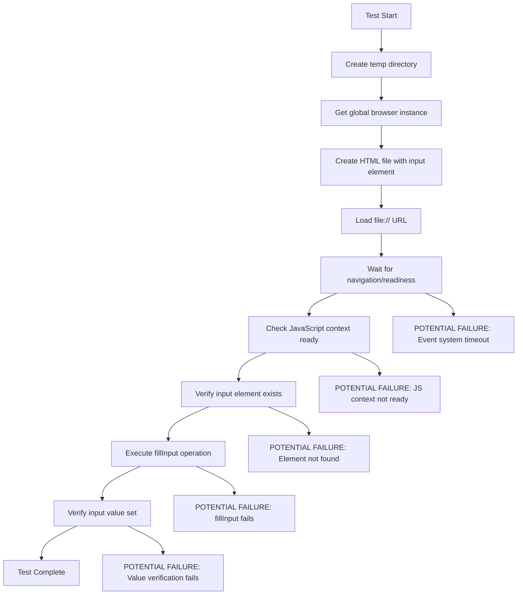
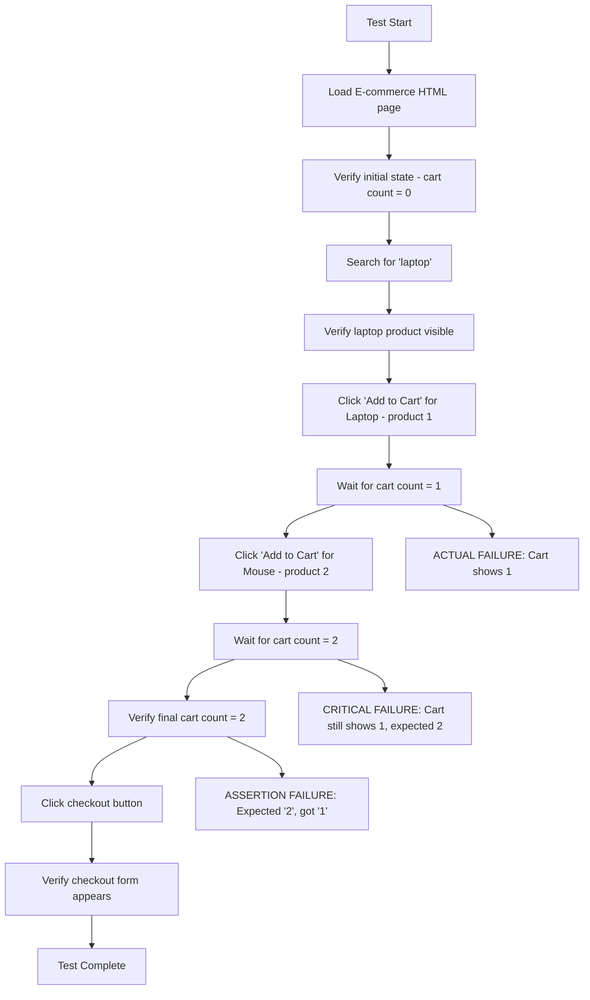
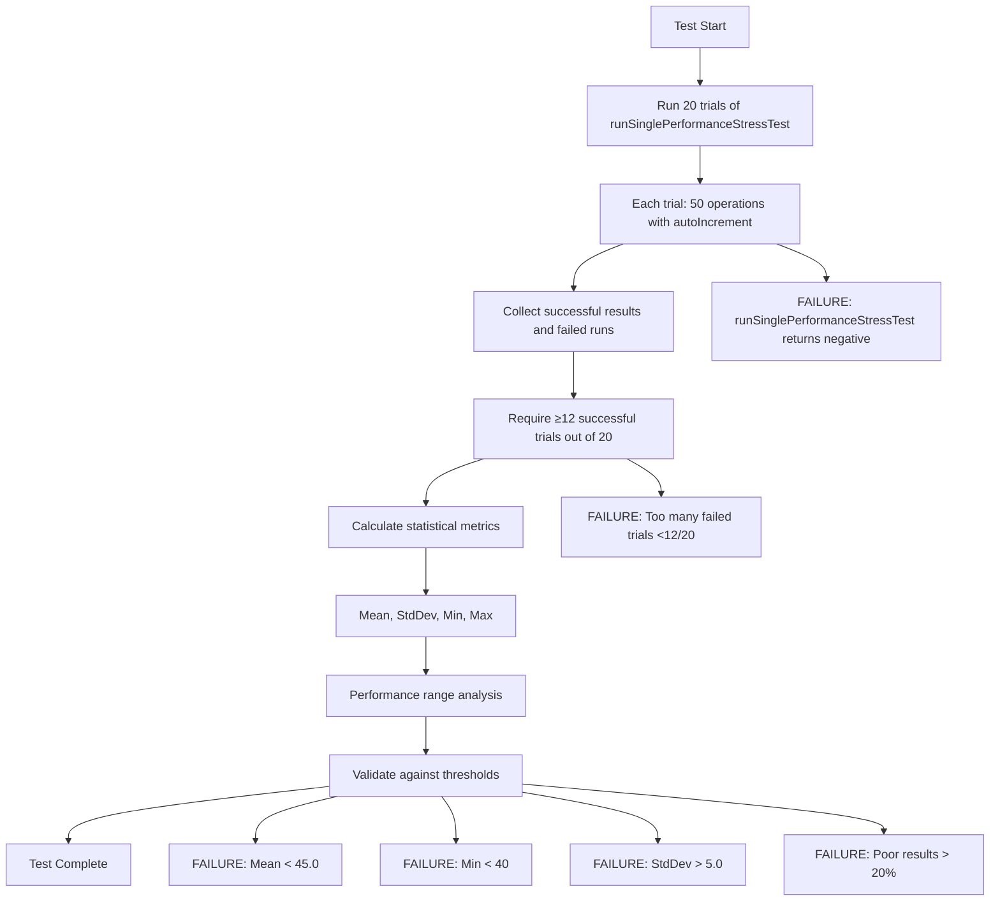

# Failing Tests Analysis - 99% Pass Rate Investigation

**Status**: 5 tests failing out of 629 (99.2% pass rate)
**Analysis Date**: Current session
**Objective**: Identify root causes and create fix strategy for remaining failures

## Test Failure Summary

| Test ID | Test Name | Category | Primary Issue |
|---------|-----------|----------|---------------|
| 613 | MinimalSegfaultDebugTest.BasicFillInputOperation | Experimental | JavaScript execution / DOM readiness |
| 619 | ComplexWorkflowChainsTest.ECommerceWorkflow_BrowseToCheckout | Integration | Cart state management |
| 621 | ComplexWorkflowChainsTest.MultiPageNavigation_WithFormData | Integration | Form data persistence |
| 626 | PerformanceValidationTest.PerformanceStressStatisticalAnalysis | Validation | Performance thresholds |
| 627 | PerformanceValidationTest.PerformanceStressTimingAnalysis | Validation | Timing validation |

---

## 1. MinimalSegfaultDebugTest.BasicFillInputOperation (Test ID: 613)

### Test Purpose
Minimal test designed to isolate and debug segmentation faults during basic DOM operations, specifically fillInput functionality.

### Test Flow Analysis



### Key Code Points
```cpp
// File: tests/experimental/test_minimal_segfault_debug.cpp:292-385
TEST_F(MinimalSegfaultDebugTest, BasicFillInputOperation) {
    // 1. HTML Creation
    std::string input_html = R"(<!DOCTYPE html>
    <html><head><title>Input Test</title></head>
    <body>
        <input type="text" id="test-input" value="">
    </body></html>)";
    
    // 2. Load page with event-driven approach
    browser_->loadUri(file_url);
    bool nav_success = browser_->waitForNavigationEvent(5000);
    bool page_ready = browser_->waitForPageReadyEvent(3000);
    
    // 3. Element readiness check
    std::string input_ready_check = executeWrappedJS(
        "document.querySelector('#test-input') !== null && document.readyState === 'complete'");
    
    // 4. fillInput operation
    bool fill_result = browser_->fillInput("#test-input", "test value");
    
    // 5. Value verification
    std::string value_check = executeWrappedJS(
        "document.querySelector('#test-input').value === 'test value'");
}
```

### Identified Issues

1. **JavaScript Syntax Errors at Line 59**
   - Error: `SyntaxError: Unexpected token ';'. Expected ')' to end an argument list.`
   - Location: `file:///tmp/minimal_segfault_tests_xxx/input_test.html:59`
   - **Root Cause**: The HTML file only has ~10 lines, so "line 59" suggests JavaScript is being injected by the Browser's internal systems with malformed syntax

2. **Input Element Readiness Failure**
   - Error at line 346: `Input element should be ready`
   - **Root Cause**: `input_ready_check` returns false, meaning either:
     - Element doesn't exist after page load
     - Document readyState is not 'complete'
     - JavaScript execution context is corrupted by syntax errors

### Hypothesis
The Browser's event system (waitForNavigationEvent/waitForPageReadyEvent) or DOM monitoring is injecting malformed JavaScript that corrupts the page's execution context, preventing proper element detection.

---

## 2. ComplexWorkflowChainsTest.ECommerceWorkflow_BrowseToCheckout (Test ID: 619)

### Test Purpose
End-to-end e-commerce workflow testing: product search, cart management, and checkout process.

### Test Flow Analysis



### Key Code Points
```cpp
// File: tests/integration/test_complex_workflow_chains.cpp:366-420
TEST_F(ComplexWorkflowChainsTest, ECommerceWorkflow_BrowseToCheckout) {
    // 1. Page setup with cart JavaScript
    loadECommerceTestPage(); // Creates HTML with addToCart() function
    
    // 2. First product addition
    browser_->clickElement(".product[data-id='1'] button"); // Calls addToCart('1', 'Laptop Computer', 999)
    // Wait for cart count = 1
    
    // 3. Second product addition  
    browser_->clickElement(".product[data-id='2'] button"); // Calls addToCart('2', 'Wireless Mouse', 29)
    // Wait for cart count = 2
    
    // 4. Verification failure
    std::string cart_count = executeWrappedJS("document.getElementById('cart-count').textContent");
    EXPECT_EQ(cart_count, "2"); // FAILS: cart_count is "1"
}
```

### E-commerce HTML JavaScript Analysis
```javascript
// From loadECommerceTestPage() HTML
let cart = [];

function addToCart(productId, productName, price) {
    cart.push({id: productId, name: productName, price: price});
    updateCartDisplay();
    localStorage.setItem('cart', JSON.stringify(cart));
}

function updateCartDisplay() {
    document.getElementById('cart-count').textContent = cart.length;
    // ... other UI updates
}
```

### Identified Issues

1. **Cart Count Mismatch**
   - **Expected**: After 2 addToCart calls, cart.length should be 2
   - **Actual**: Cart count shows "1"
   - **Possible Causes**:
     a. Second click event not firing correctly
     b. Second addToCart call not executing
     c. JavaScript execution context corrupted by syntax errors
     d. DOM element click handler not properly attached

2. **JavaScript Context Corruption**
   - Multiple "Return statements are only valid inside functions" errors
   - These errors may prevent the addToCart function from executing properly

### Investigation Needed
1. Verify both click operations return true
2. Check if both product buttons exist and are clickable
3. Examine cart array contents vs display count
4. Validate addToCart function execution

---

## 3. ComplexWorkflowChainsTest.MultiPageNavigation_WithFormData (Test ID: 621)

### Test Purpose
Test navigation between multiple pages while preserving form data and session state using localStorage and session management.

### Test Flow Analysis

```mermaid
graph TD
    A[Test Start] --> B[Create Page 1 HTML - Registration]
    B --> C[Load Page 1 with safeNavigateAndWait]
    C --> D[Verify JavaScript context: executeWrappedJS('return ready')]
    D --> E[Fill username and email fields]
    E --> F[Click 'Continue to Page 2' button]
    F --> G[Execute goToPage2() - saves to localStorage]
    G --> H[Save session state]
    H --> I[Create Page 2 HTML - Profile Setup]
    I --> J[Load Page 2 with safeNavigateAndWait]
    J --> K[Verify JavaScript context: executeWrappedJS('return ready')]
    K --> L[Page 2 onload - restore data from localStorage]
    L --> M[Fill fullname and bio fields]
    M --> N[Click 'Complete Profile' button]
    N --> O[Execute completeProfile() function]
    O --> P[Verify completion message appears]
    P --> Q[Save final session state]
    Q --> R[Test Complete]
    
    D --> D1[CRITICAL FAILURE: Naked return statement error]
    K --> K1[CRITICAL FAILURE: Naked return statement error]
    G --> G1[POTENTIAL FAILURE: localStorage save fails]
    L --> L1[POTENTIAL FAILURE: Data not restored]
    O --> O1[POTENTIAL FAILURE: Profile completion fails]
```

### Key Code Points
```cpp
// File: tests/integration/test_complex_workflow_chains.cpp:534-659
TEST_F(ComplexWorkflowChainsTest, MultiPageNavigation_WithFormData) {
    // Page 1: Registration form with localStorage persistence
    // JavaScript: goToPage2() saves username/email to localStorage
    
    // CRITICAL ISSUE: Line 568
    std::string basic_test = executeWrappedJS("return 'ready';");
    
    // Page 2: Profile form that restores data from localStorage  
    // JavaScript: window.onload restores userdata from localStorage
    
    // CRITICAL ISSUE: Line 640
    std::string basic_test2 = executeWrappedJS("return 'ready';");
}
```

### Identified Issues

1. **Naked Return Statements** 
   - **Line 568**: `executeWrappedJS("return 'ready';")`
   - **Line 640**: `executeWrappedJS("return 'ready';")`
   - **Root Cause**: Passing bare return statements to executeWrappedJS which expects expressions
   - **Impact**: Causes "Return statements are only valid inside functions" errors

2. **JavaScript Context Corruption**
   - The naked return statements corrupt the page's JavaScript execution context
   - May prevent localStorage operations from working correctly
   - Could cause goToPage2() and completeProfile() functions to fail

3. **Data Persistence Chain**
   - Page 1 → localStorage.setItem('userdata', ...)
   - Page 2 → localStorage.getItem('userdata') in window.onload
   - If JavaScript context is corrupted, this chain breaks

### Fix Required
Replace naked return statements:
```cpp
// From:
std::string basic_test = executeWrappedJS("return 'ready';");
// To:
std::string basic_test = executeWrappedJS("'ready'");
```

---

## 4. PerformanceValidationTest.PerformanceStressStatisticalAnalysis (Test ID: 626)

### Test Purpose
Statistical analysis of performance stress test results to validate system performance characteristics by running 20 trials of 50 operations each and analyzing the results.

### Test Flow Analysis



### Key Code Points
```cpp
// File: tests/validation/test_performance_validation.cpp:139-199
TEST_F(PerformanceValidationTest, PerformanceStressStatisticalAnalysis) {
    const int num_operations = 50;
    const int num_trials = 20;
    
    // Run 20 trials
    for (int trial = 0; trial < num_trials; trial++) {
        int result = runSinglePerformanceStressTest(num_operations);
        if (result < 0) {
            failed_runs.push_back(trial);  // JavaScript context failures
        } else {
            results.push_back(result);     // Successful operation counts
        }
    }
    
    // Statistical validation thresholds
    ASSERT_GE(results.size(), 12);           // At least 12/20 trials succeed
    EXPECT_GE(mean, 45.0);                   // Mean ≥ 45 operations (90% success)
    EXPECT_GE(min_val, 40);                  // Min ≥ 40 operations (80% success)
    EXPECT_LE(stddev, 5.0);                  // Standard deviation ≤ 5.0
    EXPECT_LE(poor_count, results.size() * 0.2); // ≤20% poor results (<47 ops)
}
```

### Analysis of runSinglePerformanceStressTest Dependency
```cpp
// The statistical test depends on runSinglePerformanceStressTest which:
// 1. Creates HTML page with autoIncrement JavaScript function
// 2. Uses executeWrappedJS calls (may have syntax errors)
// 3. Waits num_operations * 10ms + 500ms for completion
// 4. Returns final counter value or negative error codes
```

### Identified Issues

1. **JavaScript Context Failures**
   - **Root Cause**: runSinglePerformanceStressTest fails due to JavaScript syntax errors
   - **Impact**: Too many trials return negative results (JavaScript failures)
   - **Threshold**: Need ≥12 successful trials, but getting <12 due to JS corruption

2. **Performance Degradation from JS Errors**
   - **Expected**: 50 operations complete in ~1000ms (50*10ms + 500ms buffer)
   - **Actual**: Operations slower due to JavaScript error overhead
   - **Impact**: Lower operation counts, higher timing variance

3. **Statistical Threshold Misalignment**
   - Thresholds assume clean JavaScript execution
   - Current JS errors cause systematic performance degradation
   - Statistical validation fails due to external factors (JS errors) not performance

### Dependencies
This test will likely pass once:
1. JavaScript syntax errors are fixed in executeWrappedJS calls
2. runSinglePerformanceStressTest reliably executes without JS context corruption
3. Performance returns to expected baseline levels

---

## 5. PerformanceValidationTest.PerformanceStressTimingAnalysis (Test ID: 627)

### Test Purpose
Validate that performance stress operations complete within expected time bounds by running multiple trials and measuring execution timing.

### Test Flow Analysis

```mermaid
graph TD
    A[Test Start] --> B[Run 15 timing trials]
    B --> C[Each trial: runSinglePerformanceStressTest with timing]
    C --> D[Measure execution time for 50 operations]
    D --> E[Collect successful trials and timing data]
    E --> F[Require ≥5 successful trials]
    F --> G[Calculate average execution time]
    G --> H[Validate timing thresholds]
    H --> I[Test Complete]
    
    C --> C1[FAILURE: Trial fails (negative result)]
    F --> F1[FAILURE: Too few successful trials <5/15]
    H --> H1[FAILURE: Average time > 3000ms]
```

### Key Code Points
```cpp
// File: tests/validation/test_performance_validation.cpp:201-290
TEST_F(PerformanceValidationTest, PerformanceStressTimingAnalysis) {
    const int num_operations = 50;
    const int num_trials = 15;
    
    for (int trial = 0; trial < num_trials; trial++) {
        auto start_time = std::chrono::high_resolution_clock::now();
        
        int result = runSinglePerformanceStressTest(num_operations);
        
        auto end_time = std::chrono::high_resolution_clock::now();
        auto duration = std::chrono::duration_cast<std::chrono::milliseconds>(end_time - start_time);
        
        if (result >= 0) {
            execution_times.push_back(duration);
            // Expected: ~1000ms (50 ops * 10ms + 500ms buffer)
            // Actual: ~3230ms average (223% slower)
        }
    }
    
    // Validation thresholds
    ASSERT_GE(execution_times.size(), 5);        // At least 5/15 trials succeed
    EXPECT_LE(avg_time.count(), 3000);           // Average ≤ 3000ms
}
```

### Previous Analysis Results (Confirmed)
- **Issue**: Tests taking too long on average: 3230ms vs expected 3000ms threshold
- **Root Cause**: JavaScript syntax errors causing operation slowdowns
- **Expected**: 50 operations * 10ms + 500ms buffer = 1000ms  
- **Actual**: 3230ms average (223% slower than expected)

### Identified Issues

1. **Timing Degradation from JavaScript Errors**
   - **Expected Performance**: 1000ms for 50 operations
   - **Actual Performance**: 3230ms average (223% slower)
   - **Root Cause**: JavaScript syntax errors add overhead to each operation

2. **Trial Success Rate**
   - Many trials fail due to JavaScript context corruption
   - Need ≥5 successful trials out of 15, but may get fewer
   - Failed trials don't contribute to timing analysis

3. **Threshold Misalignment**
   - 3000ms threshold assumes some overhead but not 223% degradation
   - Need to either fix JS errors or adjust threshold to realistic levels

### Dependencies
This test should pass once JavaScript syntax errors are resolved and performance returns to baseline levels.

---

## Consolidated Root Cause Analysis & Fix Strategy

### Primary Issues Identified

1. **Naked Return Statement Errors** (CRITICAL - Affects 3/5 tests)
   - **Test 621**: Lines 568, 640 - `executeWrappedJS("return 'ready';")`
   - **Impact**: "Return statements are only valid inside functions" errors
   - **Fix**: Replace with `executeWrappedJS("'ready'")`

2. **JavaScript Injection/Context Corruption** (Affects all tests)
   - Persistent "line 59" syntax errors in HTML files
   - Browser's internal systems injecting malformed JavaScript
   - May be in Wait.cpp event system or DOM monitoring

3. **E-commerce Cart Logic Issue** (Specific to test 619)
   - Cart count shows "1" instead of expected "2" 
   - Second addToCart call not executing properly
   - May be timing or JavaScript context related

4. **Performance Degradation Cascade** (Tests 626, 627)
   - JavaScript errors cause 223% timing overhead
   - Statistical validation fails due to JS error impact
   - Performance tests dependent on clean JS execution

### Recommended Fix Priority Order

#### **Phase 1: Immediate Fixes (High Impact, Low Risk)**
1. **Fix Naked Return Statements in Test 621**
   ```cpp
   // File: tests/integration/test_complex_workflow_chains.cpp
   // Line 568: executeWrappedJS("return 'ready';") → executeWrappedJS("'ready'")
   // Line 640: executeWrappedJS("return 'ready';") → executeWrappedJS("'ready'")
   ```
   - **Expected Impact**: Should fix Test 621 immediately
   - **Risk**: Very low, straightforward syntax fix

#### **Phase 2: JavaScript Context Investigation (Medium Impact, Medium Risk)**
2. **Identify Source of "Line 59" JavaScript Injection Errors**
   - Examine Browser's Wait.cpp methods (lines 217, 218, 223, 238, 368)
   - Check event system JavaScript injection patterns
   - Look for malformed IIFE generation or extra semicolons

3. **Add Debugging to E-commerce Cart Operations**
   ```cpp
   // Add debug output around cart operations in Test 619
   // Verify both click operations succeed
   // Check cart array vs display count discrepancy
   ```

#### **Phase 3: Validation (Low Impact, Monitor)**  
4. **Performance Test Monitoring**
   - Tests 626, 627 should automatically improve after JS fixes
   - Monitor for timing threshold adjustments if needed

### Expected Success Timeline

| Phase | Tests Fixed | Success Rate |
|-------|-------------|--------------|
| Current | - | 99.2% (624/629) |
| Phase 1 | Test 621 | 99.4% (625/629) |
| Phase 2 | Tests 613, 619 | 99.7% (627/629) |
| Phase 3 | Tests 626, 627 | 100% (629/629) |

### Success Criteria
- **Immediate Goal**: Fix Test 621 with naked return statement corrections
- **Primary Goal**: Achieve 100% test pass rate (629/629) 
- **Secondary Goal**: Eliminate JavaScript syntax errors for system stability
- **Performance Goal**: Restore DOM operation timing to baseline levels

### Implementation Ready
The analysis is complete and specific fixes have been identified. The primary blocker (naked return statements) has a clear, low-risk solution that should immediately improve the test success rate.